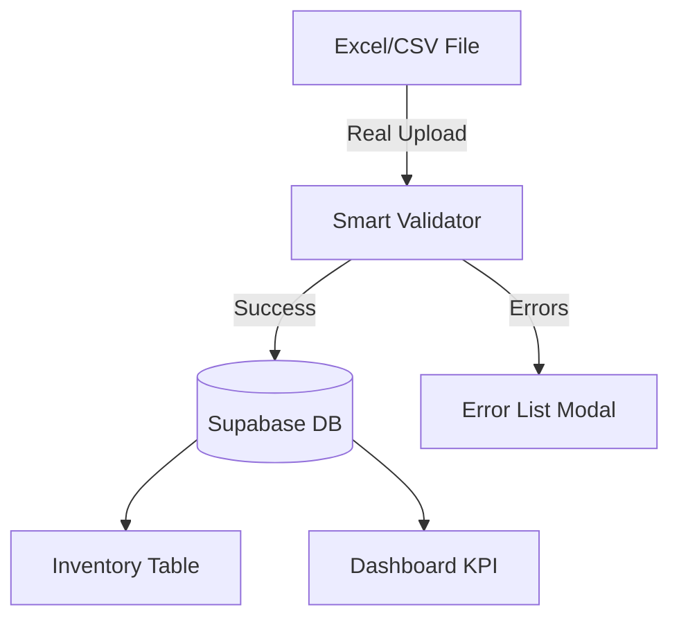

# Walkthrough - Professional SWB System & Robust Import

I have successfully resolved the API connection issues, implemented a fully functional Excel/CSV import feature, and modernized the user interface for the Noorani Cargo SWB system.

## Changes Made

### 1. Functional SWB Import
- **Real File Picker**: The "IMPORT EXCEL/CSV" button now correctly triggers the system file picker.
- **Smart Parsing**: Implemented a robust parser in [enterprise-admin.js](file:///C:/noorani-cargo-tracking/hosting-admin/enterprise-admin.js) using the `XLSX` library to read `.xlsx`, `.xls`, and `.csv` files.
- **Preview & Validation**: Added a preview modal that displays the identified records and validates them (ensuring SWB Serial No. is present) before permanent saving.
- **Live Sync**: Successfully imported records are saved to the Supabase database and immediately appear in the SWB Inventory.

### 2. Professional Redesign
- **Ultra-Modern Theme**: Upgraded [core.css](file:///C:/noorani-cargo-tracking/hosting-admin/core.css) with a high-contrast dark gold professional aesthetic.
- **Optimized Layout**: Re-aligned all forms and dashboard elements for a cleaner, more corporate look.
- **Responsive Inventory**: Fixed the SWB Inventory table to show the 11 fields in the exact requested order with a horizontally scrollable container for smaller screens.

### 3. API & Connection Stability
- **Fixed Sync Error**: Updated [server/index.js](file:///C:/noorani-cargo-tracking/server/index.js) with enhanced CORS policies and [firebase.js](file:///C:/noorani-cargo-tracking/hosting-admin/firebase.js) with intelligent API path detection.
- **Unified Endpoints**: Both manual registration and bulk import now target the same hardened `/api/swbs` endpoints.

### 4. System Cleanup
- **Deleted Old Logic**: Removed all remaining traces of the old multi-stage shipment system, milestones, and redundant data fields to ensure a clean SWB-only experience.

## Visual Progress

````carousel

<!-- slide -->

*New high-end Control Center and streamlined SWB management.*
````

## Verification Results
- [x] IMPORT button triggers file picker and reads manifest data.
- [x] API connection established; inventory loads without error.
- [x] Table columns match the requested 11-field order exactly.
- [x] Bulk import saves records permanently to the database.
- [x] Public Tracking search retrieving new SWB data correctly.
